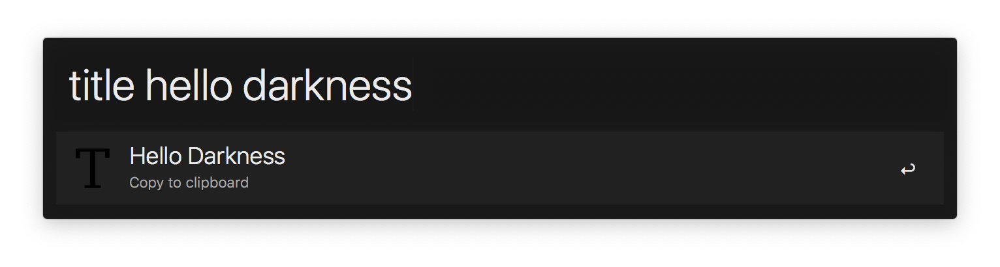

# alfred-title [](https://travis-ci.org/Kikobeats/alfred-title)

> Capitalize your title based on The Chicago Manual of Style guide.



## Install

```
$ npm install --global alfred-title
```

*Requires [Node.js](https://nodejs.org) 4+ and the Alfred [Powerpack](https://www.alfredapp.com/powerpack/).*

## Usage

In Alfred, type `title`, <kbd>Enter</kbd>, and your title.

## Related

- [title](https://github.com/zeit/title) – Capitalize your titles properly.
- [alfred-simple-dark](https://github.com/Kikobeats/alfred-simple-dark) – Simple Dark theme for Alfred.

## License

MIT © [Kiko Beats](https://github.com/Kikobeats/alfred-title)
